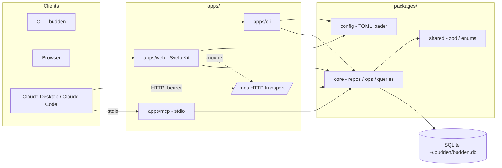

# Budden

[](https://github.com/RasmusLiltorp/budden/actions/workflows/ci.yml)
[](./LICENSE)
[](https://bun.sh)
[](#)
[](https://claude.com/claude-code)

> Self-hosted, AI-native CRM for solo founders and small teams doing manual outreach.

Three surfaces, one SQLite DB:

- **CLI** - `budden` binary for terminal-driven workflows.
- **Web UI** - SvelteKit app for visual oversight, accessible when deployed to a VPS.
- **MCP server** - connect Claude Desktop / Claude Code; talk to your CRM in natural language.

**No telemetry. No analytics. No phone-home.** Budden never makes outbound network calls
on your behalf. Your data lives in one SQLite file under `~/.budden/`.

**Single-user by design.** Budden authenticates with a single bearer token. There are no
per-user roles, no row-level ACLs, and no multi-tenancy. Run one instance per person.

## Architecture



## Quick start (dev)

```bash
bun install
bun run db:generate         # generate + bundle SQLite migrations
bun run --filter @budden/web build
./dist/budden init          # creates ~/.budden/budden.db and prints your API token
./dist/budden serve         # web UI + MCP server on http://localhost:3000
```

The CLI binary is built via `bun run build:cli` (single executable in `dist/budden`).

## MCP setup

The MCP server is mounted in two places:

- **stdio** - spawn `bun run apps/mcp/src/stdio.ts` as a subprocess (no auth; trusts the local
  process). Best for Claude Desktop and Claude Code.
- **HTTP** - mounted at `/mcp` on the web server, gated by your bearer token.

### Claude Desktop

Edit `~/Library/Application Support/Claude/claude_desktop_config.json`:

```json
{
  "mcpServers": {
    "budden": {
      "command": "bun",
      "args": ["run", "/absolute/path/to/budden/apps/mcp/src/stdio.ts"]
    }
  }
}
```

Restart Claude Desktop. You should see Budden's tools (`list_lists`, `log_interaction`,
`get_today_queue`, etc.) in the tool drawer.

### Claude Code

```bash
claude mcp add budden -- bun run /absolute/path/to/budden/apps/mcp/src/stdio.ts
```

### Remote / HTTP

Once `budden serve` is running on a VPS, point any MCP client at
`https://your-host/mcp` with `Authorization: Bearer <token>`. Hardening: bind the server to a
[Tailscale](https://tailscale.com/) interface only. See Deployment below.

The HTTP transport creates a fresh MCP server per request and has no rate limiting,
which is fine on a private network but unsafe on the public internet.

### Workflow skills

[`skills/`](./skills/) contains pre-built workflow skills you can drop into
`~/.claude/skills/` so your Claude knows how to use Budden naturally:

- `budden-morning-ritual` - daily campaign briefing
- `budden-log-outreach` - record sends / replies / notes
- `budden-followup-sweep` - draft follow-ups for the queue
- `budden-triage-inbox` - review replies + suggest next actions
- `budden-add-prospect` - create contacts with channels and list assignment

See [skills/README.md](./skills/README.md) for install + customisation.

## Status state machine

Membership status transitions are enforced by `setStatus()` in
[`packages/core/src/status.ts`](./packages/core/src/status.ts). Direct writes to the
status column are prohibited.

| From | Allowed transitions |
| --- | --- |
| `not_contacted` | `contacted`, `do_not_contact` |
| `contacted` | `replied`, `in_conversation`, `closed_lost`, `do_not_contact` |
| `replied` | `in_conversation`, `closed_lost`, `do_not_contact` |
| `in_conversation` | `booked`, `closed_lost`, `do_not_contact` |
| `booked` | `closed_won`, `closed_lost`, `do_not_contact` |
| `closed_won` | `do_not_contact` |
| `closed_lost` | `do_not_contact` |
| `do_not_contact` | (terminal) |

Outbound interactions auto-promote `not_contacted -> contacted`. Inbound interactions
auto-promote `not_contacted` or `contacted` to `replied`.

## Backup and restore

Everything Budden knows is in one SQLite file: `~/.budden/budden.db` (or `/data/budden.db`
in the Docker image). Treat it like any other SQLite database.

```bash
# Hot backup (safe while budden serve is running):
sqlite3 ~/.budden/budden.db ".backup ~/.budden/backup-$(date +%F).db"

# Cold backup (server stopped):
cp ~/.budden/budden.db ~/.budden/backup-$(date +%F).db

# Restore:
cp ~/.budden/backup-2026-04-29.db ~/.budden/budden.db
```

For Docker, snapshot the mounted `/data` volume on whatever cadence you prefer. The DB
file is plaintext on disk; if that matters, encrypt the underlying volume.

## Deployment

A Coolify-friendly Dockerfile lives in `docker/`. Mount `/data` as a persistent volume; the
container runs `budden serve` and writes the DB to `/data/budden.db`.

For a single-user self-host, expose only the Tailscale interface and never the public internet.

## Contributing

See [CONTRIBUTING.md](./CONTRIBUTING.md) for setup, house rules, and how to add MCP tools
or core operations. By participating you agree to abide by the
[Code of Conduct](./CODE_OF_CONDUCT.md).

Security issues: please follow [SECURITY.md](./SECURITY.md), not the public issue tracker.

## Colophon

Budden was designed and built end-to-end with [Claude Code](https://claude.com/claude-code),
Anthropic's coding agent. Every package, the SvelteKit app, the MCP server, the test
suite, and these docs were written in collaboration with Claude inside the terminal.

## License

MIT. See [LICENSE](./LICENSE).
